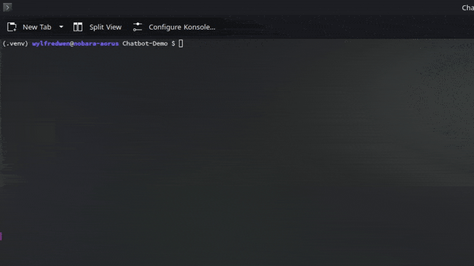

## Chatbot demo
A snapshot of ChatGPT powered chatbot I made for a business service I worked on. Posted for showcase to interested party. 




<br>

### Required installs: 

Before settingup the demo, make sure you have the following installed on your PC:
* Python 3.11 
* git

<br>

### Setup
The setup process is entirely done within a terminal or a command line interface.

1. Open a terminal or command line interface, navigate to a desired location with `cd`
1. Clone the repository:
    ```bash
    git clone https://github.com/JiayuanWen/chatbot-demo.git
    ```
2. Go into the repositor:
    ```powershell
    cd .\chatbot-demo # Or `cd ./chatbot-demo` for Linux/MacOS bash terminal
    ```
3. Create a Python virtual environment:
    ```bash
    python3.11 -m venv venv
    ```
4. Activate the virtual environment:
   * Windows CMD
        ```cmd
        venv\Scripts\activate
        ```
   * Windows PowerShell
        ```cmd
        venv\Scripts\Activate.ps1
        ```
   * Linux && MacOS
        ```bash 
        source ./venv/bin/activate
        ```
5. Install dependencies:
    ```bash
    pip install -r requirements.txt
    ```
6. Request the required `.env` file from me, place the file in the same folder as `main.py`. 
<br>

### Launch the chatbot
Before launching the chatbot, make sure you have the Python virtual environment activated to run above command, or chatbot will not work properly. Refer to step 5 of setup.

Run this command to start:
```bash
python main.py
```
